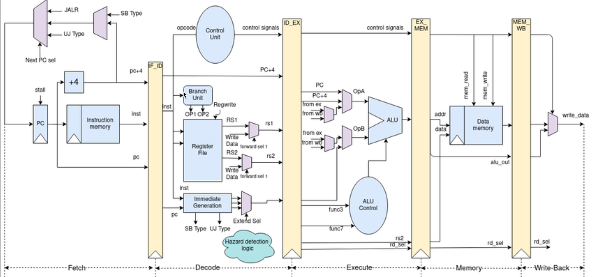

# LANCES ⚔️
lances is a RISC-V simulator that adheres to the R32i ISA 
it is written in TypeScript and uses Dominity for the frontend 

# Simulator Architecture


the simulator attempts to be as close to machine as possible in typescript,
instead of manipulation of high level abstractions , lances converts the assembly instructions to 
binary much like how real assemblers do and then feed it to the simulator core which uses bitewise operations 
to decode and execute the instructions.

as of now lances only supports the R32i instruction set 
and instruction formats ( R, I, S, B )
U and J type instructions are in development

# usage 

the site is hosted at: https://lances.vercel.app

incase you want to run it locally 

```bash
git clone 
cd lances
npm install
npm run build 
npm run start
``` 
and open http://localhost:5173 in your browser


## Features
- Supports RISC-V R32i instruction set
- Syntax Highlighting for RISC-V assembly code
- Helpful refrence for instructions
- assembly to binary viewer ( view every instruction in binary/hex/decimal )

## instructions and their implementation stages

### assembly stage

add
sub
and
or 
xor 
sll 
srl 
sra 

addi
andi
ori
xori
lw
lh
lb
lhu
lbu
sw
sh
sb
beq
bne
blt
bge
* `jal`, `jalr`

#### Not implemented in assembly stage

J and U type instructions
* `auipc`, `lui`
* `sll`, `srl`, `sra`
* `slti`, `sltiu`
* `bltu`, `bgeu`


1) srli srai

2) slt sltu slti sltiu

3) bltu bgeu

4) lui auipc

5) ecall ebreak

## dissasmbler stage 

add
sub
addi
xori
ori
andi
lb
lh
lw
lbu
lhu
sb
sh
sw
beq
bne
blt
bge

#### Not implemented  in dissasmbler stage


* `jal`, `jalr`
* `auipc`, `lui`
* `sll`, `srl`, `sra`
* `slti`, `sltiu`
* `bltu`, `bgeu`

## execution stage

add
sub
addi
xori
ori
andi

lb
lh
lw

sb
sh
sw

beq
bne
blt
bge


#### Not implemented in execution stage

Decoded but NOT Executed in Simulator
lbu
lhu


lbu
lhu
jal
jalr
lui
auipc
sll
srl
sra
slli
srli
srai
slti
sltiu
bltu
bgeu

## known issues
- Immediate sign extension bug 
- Pipe lines not implemented
- No support for system calls or interrupts

## Support 
If you find lances useful, please consider supporting its development by starring the repository or sharing it with others.


# goals features and more 

lances is built for simplicity compared to other RISC-V simulators
that runs on the web like webRISC-V 
i want a simple clean interface that is easy to use and understand

the main goals of lances is to aid learning of RISC-V assembly language and computer architecture concepts

its mostly a logical simulator 
it doesnt attempt to simulate real hardware at the transistor level or timing accurate level
its simply not in the scope of this project

- easy to use and learn interface 
- aid learning of RISC-V assembly language
- visualize instruction execution 
- visualize memory and register state
- step through instructions one at a time


